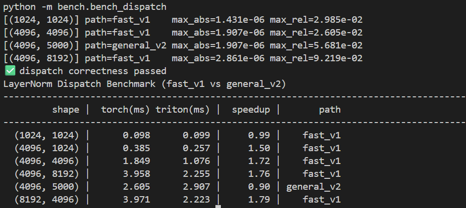

day 1
We benchmarked torch.nn.LayerNorm under fp32 vs bf16:

bf16 did not outperform fp32 (speedup ≤ 1.0x)

This suggests LayerNorm is memory-bandwidth bound rather than compute-bound

Unlike GEMM, LayerNorm consists of reductions and elementwise ops, which do not benefit significantly from Tensor Cores

Therefore the optimization target is to fuse mean/var + normalize + affine into a single kernel to reduce memory traffic and kernel launch overhead.

day 2
Correctness

We validate the Triton fused LayerNorm output against PyTorch torch.nn.functional.layer_norm across multiple shapes.

Shape (M,N)	Max Abs Error	Max Rel Error
(1024, 1024)	1.43e-06	2.99e-02
(4096, 1024)	1.91e-06	1.39e-02
(4096, 4096)	1.91e-06	4.41e-02
(4096, 8192)	1.91e-06	1.03e-01

Note: Relative error can appear large for elements where the reference output is close to zero. Max absolute error remains at ~1e-6, indicating high numerical accuracy.

got speedup: X1.79

Day3: Tuning Triton LayerNorm Parameters

We sweep BLOCK_N and num_warps for shape (4096,4096).

BLOCK_N	warps	median latency (ms)
512	2	0.115
512	4	0.137
512	8	0.230
1024	2	0.187
2048	2	0.352
4096	2	0.990
8192	2	1.019

Best configuration: BLOCK_N=512, num_warps=2.

Observation: Larger blocks (>=2048) significantly increase latency, likely due to reduced occupancy and increased register pressure. Using more warps also hurts performance for this memory-bound operator.

Day4: General LayerNorm Kernel (Two-pass)

We implemented a general LayerNorm forward kernel that supports arbitrary hidden sizes (including non-power-of-two shapes).

Correctness

Validated against PyTorch LayerNorm across multiple shapes including (4096, 5000).
Max absolute error remains ~1e-6.

Performance

For shape (4096, 4096):

PyTorch: 1.911 ms

Triton v2: 1.643 ms

Speedup: 1.16×

Tuning

Sweeping (BLOCK_N, num_warps) yields best config:

BLOCK_N=512, num_warps=4 → 1.642 ms

Insight

Compared to v1 (single-pass fused kernel), v2 uses a two-pass approach (stats pass + normalize pass), increasing global memory traffic (reading x twice).
Since LayerNorm is memory-bandwidth bound, the additional memory reads reduce achievable speedup despite improved generality.

day5 
Results (RTX 3060 Laptop)

We benchmarked PyTorch LayerNorm vs Triton LayerNorm with shape-based dispatch:

fast_v1: single-pass fused kernel optimized for power-of-two hidden sizes (N ≤ 8192)

general_v2: two-pass kernel supporting arbitrary N

Shape (M,N)	PyTorch (ms)	Triton (ms)	Speedup	Path
(4096, 1024)	0.400	0.261	1.54×	fast_v1
(4096, 4096)	1.888	1.109	1.70×	fast_v1
(4096, 8192)	4.005	2.322	1.72×	fast_v1
(8192, 4096)	3.935	2.247	1.75×	fast_v1
(4096, 5000)	2.682	2.893	0.93×	general_v2
Key Insight

LayerNorm is primarily memory-bandwidth bound. The single-pass fused kernel reduces global memory traffic and achieves up to 1.75× speedup on power-of-two hidden sizes. For non-power-of-two sizes, the general two-pass kernel introduces additional memory reads and masked tail inefficiency, making it slower than PyTorch in some cases. Therefore, we use a fast-path specialization + general fallback design.

